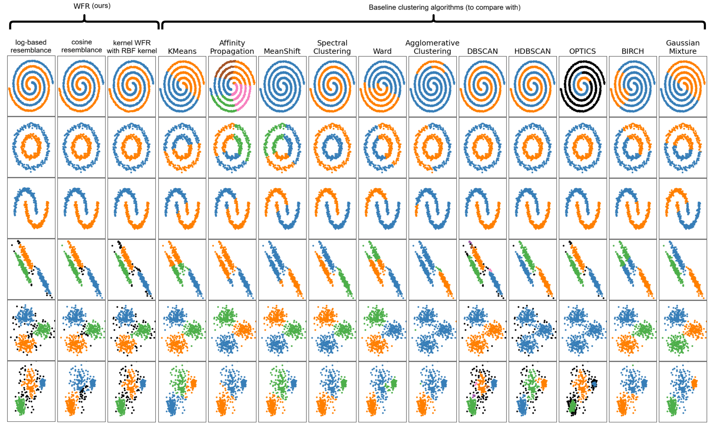

# WFR Clustering
The Wittgenstein's Family Resemblance (WFR) clustering algorithm

[](https://arxiv.org/abs/2601.01127)

This is the code for the following paper: 
- Golbahar Amanpour, Benyamin Ghojogh. "Wittgenstein's Family Resemblance Clustering Algorithm", arXiv preprint arXiv:2601.01127, 2026.
- Link to paper: https://arxiv.org/abs/2601.01127

# Simulation on toy benchmarks



# Installing the environments

Install the packages in a conda environment: 
```bash
conda env create --file environment.yml
```

# Functions of the WFR Class

This is a Scikit-learn–compatible implementation of the WFR algorithm: 
- Class:
```python
wfr = WFR(resemblance_measure: Optional[str] = "log_based",
        resemblance_threshold: Optional[float] = None,
        resemblance_threshold_grid_search_step: Optional[float] = 0.01,
        mark_outliers_as_minus_one: Optional[bool] = False,
        knn_k: Optional[int] = 10,
        knn_sklearn_algorithm: Optional[str] = "auto",
        knn_approx_method: Optional[str] = None,
        kernel: Optional[str] = "rbf")
```
- Fitting (training):
```python
wfr.fit(X: np.ndarray)
```
- Fitting (training) and predicting:
```python
y_pred = wfr.fit_predict(X: np.ndarray)
```
- Predicting:
```python
y_pred = wfr.predict(X: np.ndarray)
```

# How to use this code

- Set the config in `./config/config.yaml`
```yaml
# data paths:
traininig_data_path: ./files/X_train.csv
test_data_path: ./files/X_test.csv
make_toy_data: false  # if true, a toy dataset will be made and used for training and test. 

resemblance_measure: log_based
# The measure for calculating resemblance of data points.
# Defaults to cosine similarity.
# Options: log_based, cosine, kernel

resemblance_threshold: null
# Value in [0, 1] for thresholding normalized resemblance matrix.
# If not provided, automatic threshold is used, but that will slow down the clustering. 

resemblance_threshold_grid_search_step: 0.01
# Value in [0, 1] for the step of grid search for the best resemblance_threshold.
# This is used only when resemblance_threshold is None (not provided).

mark_outliers_as_minus_one: true
# Whether to mark outliers as -1 or not (as singleton clusters).

knn_k: 10
# Use KNN graph with this many neighbors.
# If given as None, all points are used, i.e., k=n 

knn_sklearn_algorithm: auto
# algorithm used in KNN of sklearn: {'auto', 'ball_tree', 'kd_tree', 'brute'}

kernel: rbf
# Used only when resemblance_measure="kernel"
# Options are cosine, linear, poly, rbf, sigmoid
```
- Run the code: 
```bash
conda activate wfr
python main.py
```
- If you want to run the toy examples, run this:
```bash
conda activate wfr
python toy_example.py
```
